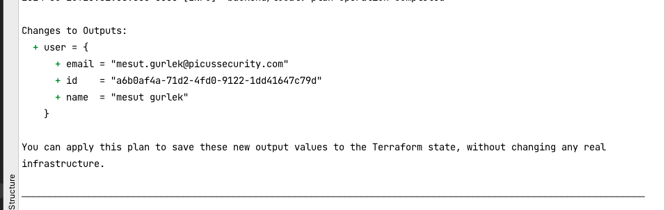

# Internal Identity Service Terraform Plugin/Provider 

* Only Read Operations implemented. (Data blocks)

## Local Development

### Terraform Configuration
```
user="muhammedkaya"
cat <<EOF > ~/.terraformrc
provider_installation {

  dev_overrides {
      "registry.terraform.io/picusnext/internalidentity" = "/Users/$user/go/bin"
  }

  direct {}
}
EOF
```

### Compile Plugin/Binary
```
user="muhammedkaya"
cd terraform-provider-internal-identity
export GOBIN="/Users/$user/go/bin"
go install .
```

### Test Terraform Module
```
cd terraform-provider-internal-identity/examples/data-sources
export TF_LOG=DEBUG
# You do not need to run terraform init
# Set Api key variable
export TF_VAR_internalidentity_api_key="" 
export TF_VAR_internalidentity_base_url="https://internal-identity-service.api.xops.picus.io"
terraform plan 
```
* **Expected Output** 




### Resources

* https://github.com/rapidappio/terraform-provider-rapidapp/blob/main/internal/provider/postgres_database_data_source.go
* https://spacelift.io/blog/terraform-custom-provider
* https://developer.hashicorp.com/terraform/plugin/framework/handling-data/attributes/list-nested